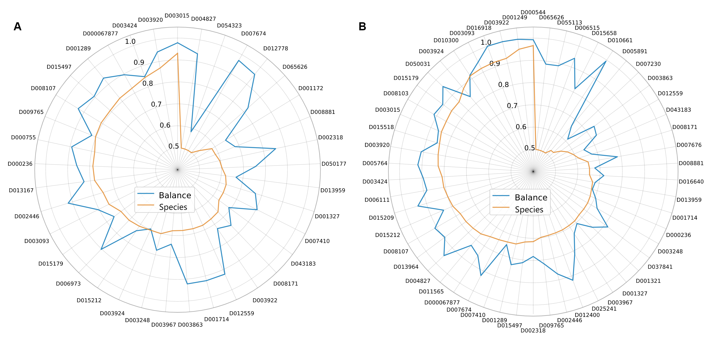

# GutBalance1.0
Data and codes for GutBalance web-server

Balance-based approach outperform the conventional biomarker (Species)-based approach in terms of AUC in distinguishing disease samples from control samples (**A** shotgun metagenomic samples, **B** amplicon samples), in major diseases, using similar number of features.

